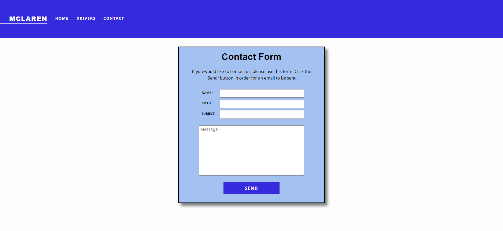

# Umbraco Contact Form

## Contact Form

### MVC
Model: [/Models/EmailModel.cs](https://github.com/DanielPitfield/Umbraco_Dev_Test/blob/master/McLarenUmbraco/Models/EmailModel.cs)

View (Form): [/Views/Partials/Forms/Email/Email.cshtml](https://github.com/DanielPitfield/Umbraco_Dev_Test/blob/master/McLarenUmbraco/Views/Partials/Forms/Email/Email.cshtml)

View (Page): [/Views/Contact.cshtml](https://github.com/DanielPitfield/Umbraco_Dev_Test/blob/master/McLarenUmbraco/Views/Contact.cshtml)

Controller: [/Controllers/EmailController.cs](https://github.com/DanielPitfield/Umbraco_Dev_Test/blob/master/McLarenUmbraco/Controllers/EmailController.cs)

### Email Configuration
The email address the email is sent to can be configured within the Controller.

A comment within the SendEmail() method explains how this can be changed (refer to Line 69 and Line 70 of EmailController.cs).

### Known Issues
A newly created Gmail account is used as authentication to the Gmail SMTP server. The authentication details (i.e login details for that account) are included in version control.
Better practice would be to obtain OAuth 2.0 credentials for the solution and use access tokens.

A maximum length for the input values is not enforced (limited testing shows this is particularly problematic with a long input value for the 'Name' field, with the email either not being sent or taking considerable time to reach the recipient).
